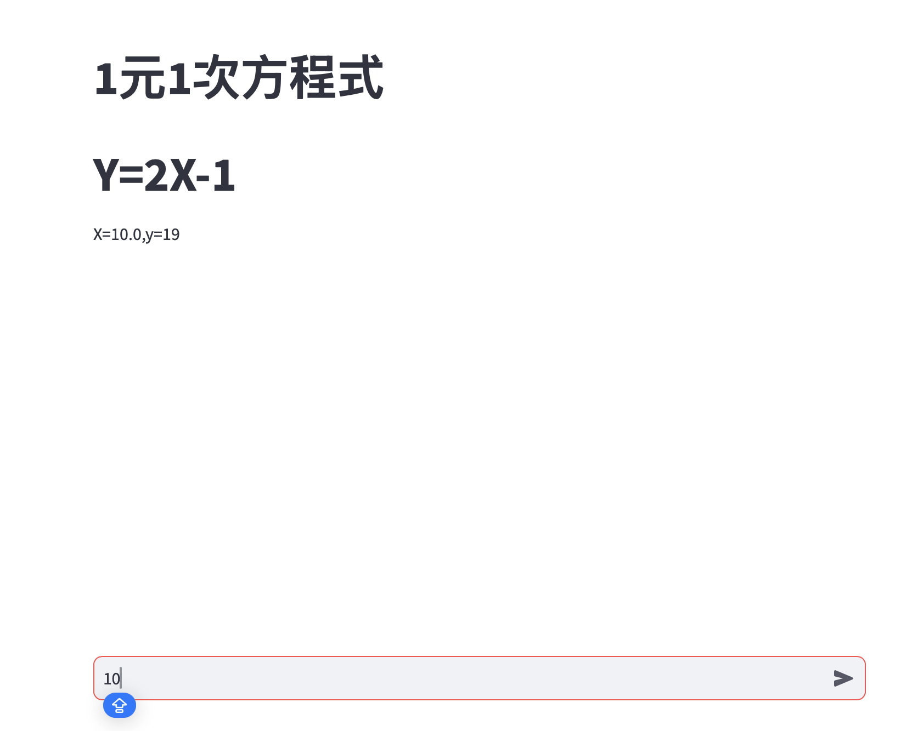

# 線性迴歸(y=2x-1)

- **建立模型**

```python
import tensorflow as tf
import numpy as np

# Convert the model to TensorFlow Lite
def convert_to_tflite(model, output_path='model.tflite'):
    """
    Convert a TensorFlow Keras model to TensorFlow Lite format
    
    Args:
        model (tf.keras.Model): The trained Keras model
        output_path (str): Path to save the converted TFLite model
    
    Returns:
        bytes: TFLite model in byte format
    """
    # Convert the model
    converter = tf.lite.TFLiteConverter.from_keras_model(model)
    
    # Optional: Add optimization techniques
    converter.optimizations = [tf.lite.Optimize.DEFAULT]
    
    # Convert the model
    tflite_model = converter.convert()
    
    # Save the model to disk
    with open(output_path, 'wb') as f:
        f.write(tflite_model)
    
    print(f"TFLite model saved to {output_path}")

   

# Original model training
model = tf.keras.Sequential([
    tf.keras.layers.Dense(units=1, input_shape=[1])
])
model.compile(optimizer='sgd', loss='mean_squared_error')

x = [-1, 0, 1, 2, 3, 4]
y = [-3, -1, 1, 3, 5, 7]
xs = np.array(x, dtype=float)
ys = np.array(y, dtype=float)

model.fit(xs, ys, epochs=500)

# Convert the model to TFLite
tflite_model_path = 'linear_model.tflite'
convert_to_tflite(model, tflite_model_path)
```

**建立介面**

```python
import streamlit as st
import tensorflow as tf
import numpy as np

def load_and_use_tflite(tflite_model_path):
    """
    Load a TensorFlow Lite model and use it for prediction
    
    Args:
        tflite_model_path (str): Path to the .tflite model file
    
    Returns:
        TFLite Interpreter
    """
    # Load the TFLite model
    interpreter = tf.lite.Interpreter(model_path=tflite_model_path)
    interpreter.allocate_tensors()
    
    # Get input and output tensors
    input_details = interpreter.get_input_details()
    output_details = interpreter.get_output_details()
    
    # Function to predict using the TFLite model
    def predict(input_data):
        # Prepare input data
        input_data = np.array(input_data, dtype=np.float32).reshape(input_details[0]['shape'])
        
        # Set the tensor to point to the input data to be inferred
        interpreter.set_tensor(input_details[0]['index'], input_data)
        
        # Run inference
        interpreter.invoke()
        
        # Get the output tensor
        output_data = interpreter.get_tensor(output_details[0]['index'])
        
        return output_data
    
    return predict

st.title("1元1次方程式")
st.title("Y=2X-1")

prompt = st.chat_input("請輸入一個整數數值")
if prompt:
    input_value = float(prompt)
    tflite_model_path = 'linear_model.tflite'
    # Load the TFLite model
    tflite_predict = load_and_use_tflite(tflite_model_path)
    # Make predictions
    test_input = [input_value]
    predict_value = tflite_predict(test_input)
    round_value= round(float(predict_value[0][0]))
    st.write(f"X={input_value},y={round_value}")

```

