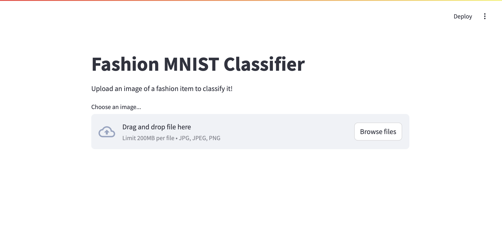

# Fashion MNIST-上傳圖片版



```python
import streamlit as st
import tensorflow as tf
import numpy as np
from PIL import Image
import io

# Class names for Fashion MNIST
class_names = ['T-shirt/top', 'Trouser', 'Pullover', 'Dress', 'Coat',
               'Sandal', 'Shirt', 'Sneaker', 'Bag', 'Ankle boot']

def load_model():
    """Load the trained model"""
    model = tf.keras.Sequential([
        tf.keras.layers.Flatten(input_shape=(28, 28)),
        tf.keras.layers.Dense(128, activation='relu'),
        tf.keras.layers.Dense(10, activation='softmax')
    ])
    
    model.compile(optimizer='adam',
                 loss='sparse_categorical_crossentropy',
                 metrics=['accuracy'])
    
    return model

def preprocess_image(image):
    """Preprocess the uploaded image to match the model's requirements"""
    # Convert to grayscale
    image = image.convert('L')
    # Resize to 28x28
    image = image.resize((28, 28))
    # Convert to numpy array and normalize
    image = np.array(image)
    image = image / 255.0
    # Add batch dimension
    image = image.reshape(1, 28, 28)
    return image

def main():
    st.title("Fashion MNIST Classifier")
    st.write("Upload an image of a fashion item to classify it!")

    # Load the model
    model = load_model()

    # File uploader
    uploaded_file = st.file_uploader("Choose an image...", type=["jpg", "jpeg", "png"])

    if uploaded_file is not None:
        # Display the uploaded image
        image = Image.open(uploaded_file)
        st.image(image, caption='Uploaded Image', use_column_width=True)
        
        # Add a button to perform prediction
        if st.button('Predict'):
            # Preprocess the image
            processed_image = preprocess_image(image)
            
            # Make prediction
            prediction = model.predict(processed_image)
            predicted_class = np.argmax(prediction)
            
            # Display results
            st.write("### Prediction Results")
            st.write(f"This appears to be a: **{class_names[predicted_class]}**")
            
            # Show prediction probabilities
            st.write("### Prediction Probabilities")
            for i, prob in enumerate(prediction[0]):
                st.write(f"{class_names[i]}: {prob*100:.2f}%")
            
            # Create a bar chart of probabilities
            st.bar_chart(dict(zip(class_names, prediction[0])))

if __name__ == '__main__':
    main()
```