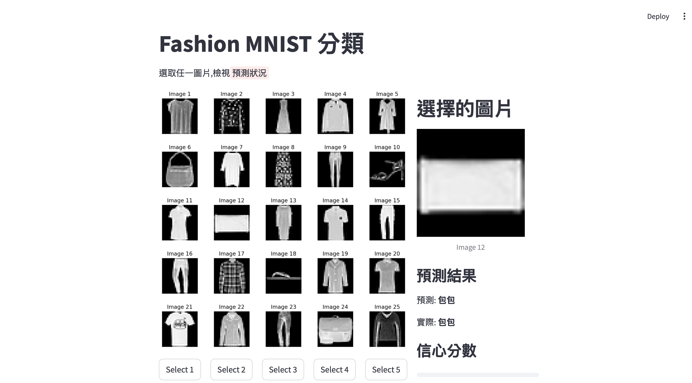

# Fashion MNIST - 5x5 grid 介面

## 1. 訓練模型並建立tflite檔(create_model.py)

```python
import tensorflow as tf

def convert_to_tflite(model, output_path='model.tflite'):
    """
    轉換Tensorflow keras model 到 TensorFlow Lite format
    Args:
        model (tf.keras.Model):已經訓練好的模型
        output_path (str):儲存tflite模型的路徑
    """
    #轉換模型
    converter = tf.lite.TFLiteConverter.from_keras_model(model)
    
    #optional:增加最佳化
    converter.optimizations = [tf.lite.Optimize.DEFAULT]

    #轉換模型
    tflite_model = converter.convert()

    #儲存模型成為檔案
    with open(output_path,'wb') as f:
        f.write(tflite_model)
    
    print("儲存模型成功")

class myCallback(tf.keras.callbacks.Callback):
    def on_epoch_end(self, epoch, logs={}):
        if(logs.get('accuracy')>0.95):
            print("\n到達95%準確度,停止訓練!")
            print(f"目前訓練至第{epoch}趟")
            self.model.stop_training = True

callbacks = myCallback()
data = tf.keras.datasets.fashion_mnist
(train_images, train_labels), (test_images, test_labels) = data.load_data()
train_images = train_images / 255.0
test_images = test_images / 255.0

model = tf.keras.Sequential([
    tf.keras.layers.Flatten(input_shape=(28, 28)),
    tf.keras.layers.Dense(128, activation='relu'),
    tf.keras.layers.Dense(10, activation='softmax')
    ])

model.compile(optimizer='adam',
              loss='sparse_categorical_crossentropy',
              metrics=['accuracy'])

model.fit(train_images, train_labels, epochs=50,callbacks=callbacks)
tflite_model_path = 'MNIST_fasion.tflite'
convert_to_tflite(model,tflite_model_path)

```




```python
import streamlit as st
import tensorflow as tf
import numpy as np
import matplotlib.pyplot as plt

# Class names for Fashion MNIST
class_names = ['T-shirt/top', 'Trouser', 'Pullover', 'Dress', 'Coat',
               'Sandal', 'Shirt', 'Sneaker', 'Bag', 'Ankle boot']

def load_model():
    """Load the trained model"""
    model = tf.keras.Sequential([
        tf.keras.layers.Flatten(input_shape=(28, 28)),
        tf.keras.layers.Dense(128, activation='relu'),
        tf.keras.layers.Dense(10, activation='softmax')
    ])
    
    model.compile(optimizer='adam',
                 loss='sparse_categorical_crossentropy',
                 metrics=['accuracy'])
    
    return model

def create_image_grid(images, labels, selected_idx=None):
    """Create a 5x5 grid of images with selection highlight"""
    fig, axs = plt.subplots(5, 5, figsize=(10, 10))
    fig.subplots_adjust(hspace=0.5)
    
    for idx, ax in enumerate(axs.flat):
        if idx < len(images):
            ax.imshow(images[idx], cmap='gray')
            if selected_idx == idx:
                # Highlight selected image with a red border
                ax.patch.set_edgecolor('red')
                ax.patch.set_linewidth(2)
            ax.axis('off')
            ax.set_title(f'Image {idx + 1}')
    
    return fig

def main():
    st.title("Fashion MNIST Classifier")
    st.write("Select an image from the grid to see its prediction!")

    # Load the model
    model = load_model()

    # Load Fashion MNIST dataset
    (_, _), (test_images, test_labels) = tf.keras.datasets.fashion_mnist.load_data()
    
    # Select first 25 test images
    display_images = test_images[:25]
    display_labels = test_labels[:25]

    # Create columns for layout
    col1, col2 = st.columns([2, 1])

    # Store the selected index in session state
    if 'selected_idx' not in st.session_state:
        st.session_state.selected_idx = None

    # Display image grid in the first column
    with col1:
        fig = create_image_grid(display_images, display_labels, st.session_state.selected_idx)
        st.pyplot(fig)
        
        # Create a 5x5 grid of buttons
        cols = st.columns(5)
        for i in range(25):
            col_idx = i % 5
            with cols[col_idx]:
                if st.button(f'Select {i + 1}', key=f'btn_{i}'):
                    st.session_state.selected_idx = i

    # Display prediction in the second column
    with col2:
        if st.session_state.selected_idx is not None:
            st.write("### Selected Image")
            selected_image = display_images[st.session_state.selected_idx]
            st.image(selected_image, caption=f'Image {st.session_state.selected_idx + 1}', width=200)
            
            # Preprocess and predict
            processed_image = selected_image / 255.0
            prediction = model.predict(processed_image.reshape(1, 28, 28))
            predicted_class = np.argmax(prediction)
            actual_class = display_labels[st.session_state.selected_idx]
            
            st.write("### Prediction Results")
            st.write(f"Predicted: **{class_names[predicted_class]}**")
            st.write(f"Actual: **{class_names[actual_class]}**")
            
            # Show prediction probabilities
            st.write("### Confidence Scores")
            for i, prob in enumerate(prediction[0]):
                st.progress(float(prob))
                st.write(f"{class_names[i]}: {prob*100:.1f}%")

if __name__ == '__main__':
    main()
```