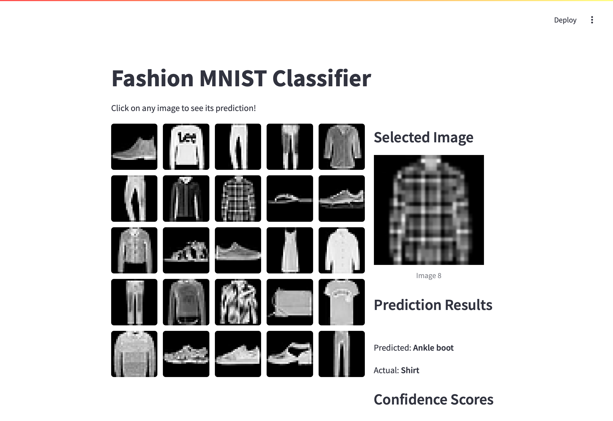

# Fashion MNIST - 5x5 grid 介面(進階版)
- 使用擴充套件streamlit_clickable_images
‌
## 1. 訓練模型並建立tflite檔(create_model.py)

```python
import tensorflow as tf

def convert_to_tflite(model, output_path='model.tflite'):
    """
    轉換Tensorflow keras model 到 TensorFlow Lite format
    Args:
        model (tf.keras.Model):已經訓練好的模型
        output_path (str):儲存tflite模型的路徑
    """
    #轉換模型
    converter = tf.lite.TFLiteConverter.from_keras_model(model)
    
    #optional:增加最佳化
    converter.optimizations = [tf.lite.Optimize.DEFAULT]

    #轉換模型
    tflite_model = converter.convert()

    #儲存模型成為檔案
    with open(output_path,'wb') as f:
        f.write(tflite_model)
    
    print("儲存模型成功")

class myCallback(tf.keras.callbacks.Callback):
    def on_epoch_end(self, epoch, logs={}):
        if(logs.get('accuracy')>0.95):
            print("\n到達95%準確度,停止訓練!")
            print(f"目前訓練至第{epoch}趟")
            self.model.stop_training = True

callbacks = myCallback()
data = tf.keras.datasets.fashion_mnist
(train_images, train_labels), (test_images, test_labels) = data.load_data()
train_images = train_images / 255.0
test_images = test_images / 255.0

model = tf.keras.Sequential([
    tf.keras.layers.Flatten(input_shape=(28, 28)),
    tf.keras.layers.Dense(128, activation='relu'),
    tf.keras.layers.Dense(10, activation='softmax')
    ])

model.compile(optimizer='adam',
              loss='sparse_categorical_crossentropy',
              metrics=['accuracy'])

model.fit(train_images, train_labels, epochs=50,callbacks=callbacks)
tflite_model_path = 'MNIST_fasion.tflite'
convert_to_tflite(model,tflite_model_path)

```

## 2. 載入模型並建立介面(interface.py)



```python
import streamlit as st
from streamlit_clickable_images import clickable_images
import tensorflow as tf
import numpy as np
import matplotlib.pyplot as plt
import io
import base64

# Class names for Fashion MNIST
#class_names = ['T-shirt/top', 'Trouser', 'Pullover', 'Dress', 'Coat',
# 'Sandal', 'Shirt', 'Sneaker', 'Bag', 'Ankle boot']
# Class names for Fashion MNIST
class_names = ['T恤/上衣', '褲子', '毛衣', '連衣裙', '外套',
                '涼鞋', '襯衫', '運動鞋', '包包', 'ankle boot(踝靴)']
def load_and_use_tflite(tflite_model_path:str):
    """
    載入tflite模型和傳出預測function
    Args
        tflite_mode_path(str):模型的路徑
    """
    #載入模型
    interpreter = tf.lite.Interpreter(model_path=tflite_model_path)
    
    #為模型配置記憶體
    interpreter.allocate_tensors()

    #取得輸入和輸出的資訊
    input_details = interpreter.get_input_details()
    output_details = interpreter.get_output_details()

    print(input_details)
    print(output_details)

    #使用tflite模型預測的function
    def predict(input_data):
        #input_data的ndarray的type是int32,轉換型別
        input_data = input_data.astype(np.float32)
        #準備input data
        input_data = input_data.reshape(input_details[0]['shape'])
        
        #將input_tensor指定給模型輸入(使用index編號)
        interpreter.set_tensor(input_details[0]['index'],input_data)
        
        #執行預測
        interpreter.invoke()

        #取得輸出的tensor
        output_data = interpreter.get_tensor(output_details[0]['index'])
        return output_data

    return predict


def convert_image_to_base64(image_array):
    """Convert numpy array to base64 string"""
    plt.figure(figsize=(3, 3))
    plt.imshow(image_array, cmap='gray')
    plt.axis('off')
    
    # Save the plot to a buffer
    buf = io.BytesIO()
    plt.savefig(buf, format='png', bbox_inches='tight', pad_inches=0)
    plt.close()
    
    # Convert to base64
    buf.seek(0)
    image_base64 = base64.b64encode(buf.getvalue()).decode()
    return f"data:image/png;base64,{image_base64}"

def main():
    st.title("Fashion MNIST 分類")
    st.write("選取任一圖片,檢視:red-background[預測狀況]")

    # Load the model
    # model = load_model()
    tflite_path = 'MNIST_fasion.tflite'
    predict = load_and_use_tflite(tflite_path)

    # Load Fashion MNIST dataset
    (_, _), (test_images, test_labels) = tf.keras.datasets.fashion_mnist.load_data()
    
    # Select first 25 test images
    # 隨機選擇25個不重複的索引 (從0到9999)
    # 初始化 session_state 中的隨機索引,因為初始化時只要執行一次
    if 'random_indices' not in st.session_state:
        st.session_state['random_indices'] = np.random.choice(len(test_images), size=25, replace=False)
    

    # 使用這些索引獲取圖片和標籤
    display_images = test_images[st.session_state.random_indices]
    display_labels = test_labels[st.session_state.random_indices]
    
    # Convert images to base64 strings
    image_paths = [convert_image_to_base64(img) for img in display_images]

    # Create columns for layout
    col1, col2 = st.columns([2, 1])

    with col1:
        # Display clickable image grid
        clicked = clickable_images(
            image_paths,
            titles=[f"Image {i+1}" for i in range(len(image_paths))],
            div_style={"display": "grid", "grid-template-columns": "repeat(5, 1fr)", "gap": "10px"},
            img_style={"cursor": "pointer", "border-radius": "5px", 
                      "transition": "transform 0.3s", "width": "100%"}
        )

    # Display prediction in the second column
    with col2:
        if clicked > -1:  # If an image was clicked
            st.write("### 選擇的圖片")
            selected_image = display_images[clicked]
            st.image(selected_image, caption=f'Image {clicked + 1}', width=200)
            
            # Preprocess and predict
            processed_image = selected_image / 255.0
            prediction = predict(processed_image)
            predicted_class = np.argmax(prediction)
            actual_class = display_labels[clicked]
            
            st.write("### 預測結果")
            st.write(f"預測: **{class_names[predicted_class]}**")
            st.write(f"實際: **{class_names[actual_class]}**")
            
            # Show prediction probabilities
            st.write("### 信心分數")
            for i, prob in enumerate(prediction[0]):
                st.progress(float(prob))
                st.write(f"{class_names[i]}: {prob*100:.1f}%")

if __name__ == '__main__':
    main()
```