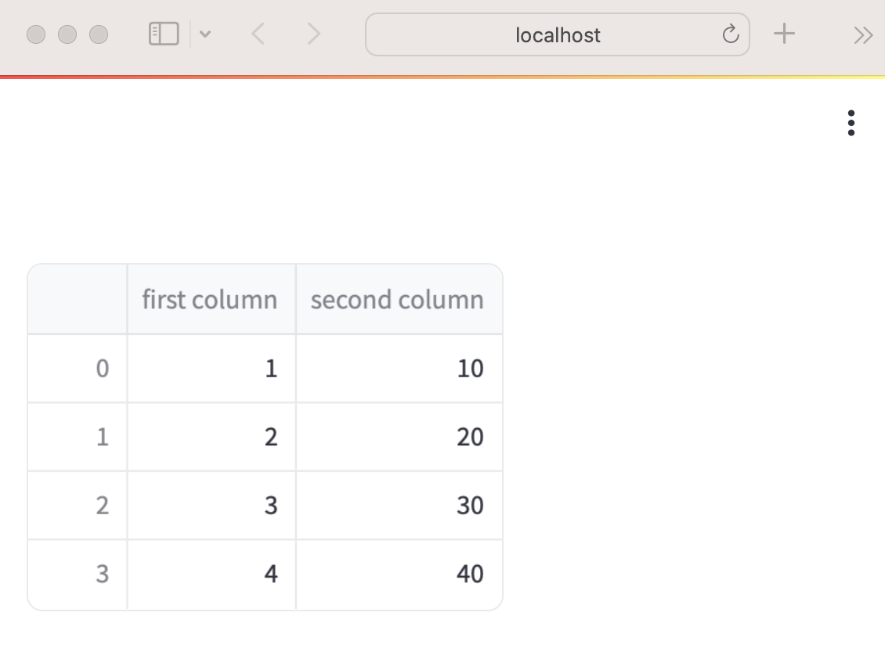
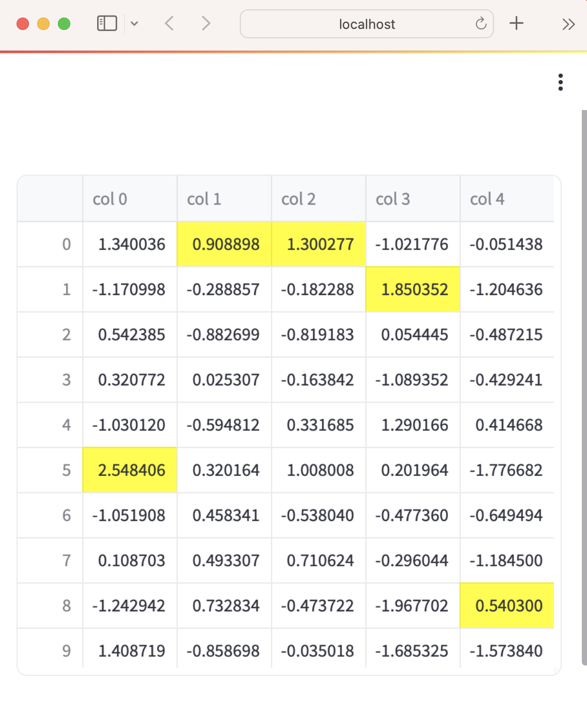

## 快速入門(重要觀念)

### 開發階段
- #### 開啟右上方'Always rerun',達到及時更新
- #### side by side(螢幕左右各開一個視窗,一個為編輯器,一個為browser)

### 程式執行流程
- streamlit的程式流程和一般視窗和後端程式不一樣
- streamlit在以下2程情況會自動更新螢幕畫面(streamlit會由上而下執行所有的程式碼)
	- app的程式碼被更新時
	- 當使用者和工具(widgets)互動時,如使用者按下按鈕

由於以上的特性,使用者和工具互動時,會觸發on_change 或(on_click)的事件，並執行事件的callback function，但後面的程式並還未執行

如果要執行大量的資料,要使用@st.cache_data decorator, 以便app有更好的執行效能。

### 畫面的顯示和資料的修飾
#### 神奇的st.write()
- 文字
- 圖片
- 表格
- DataFrame
- list

#### 範例1:顯示DataFrame

```python
# 當輸出df變數時,st.write()會自動執行
"""
# My first app
Here's our first attempt at using data to create a table:
"""

import streamlit as st
import pandas as pd
df = pd.DataFrame({
  'first column': [1, 2, 3, 4],
  'second column': [10, 20, 30, 40]
})

df
```



```python
# 也可以使用st.write(df)
import streamlit as st
import pandas as pd

st.write("Here's our first attempt at using data to create a table:")
st.write(pd.DataFrame({
    'first column': [1, 2, 3, 4],
    'second column': [10, 20, 30, 40]
}))
```

#### 範例2:
- 使用st.dataframe(),顯示Styler

```python
import streamlit as st
import numpy as np
import pandas as pd

dataframe = pd.DataFrame(
    np.random.randn(10, 20),
    columns=('col %d' % i for i in range(20)))

st.dataframe(dataframe.style.highlight_max(axis=0))
```


