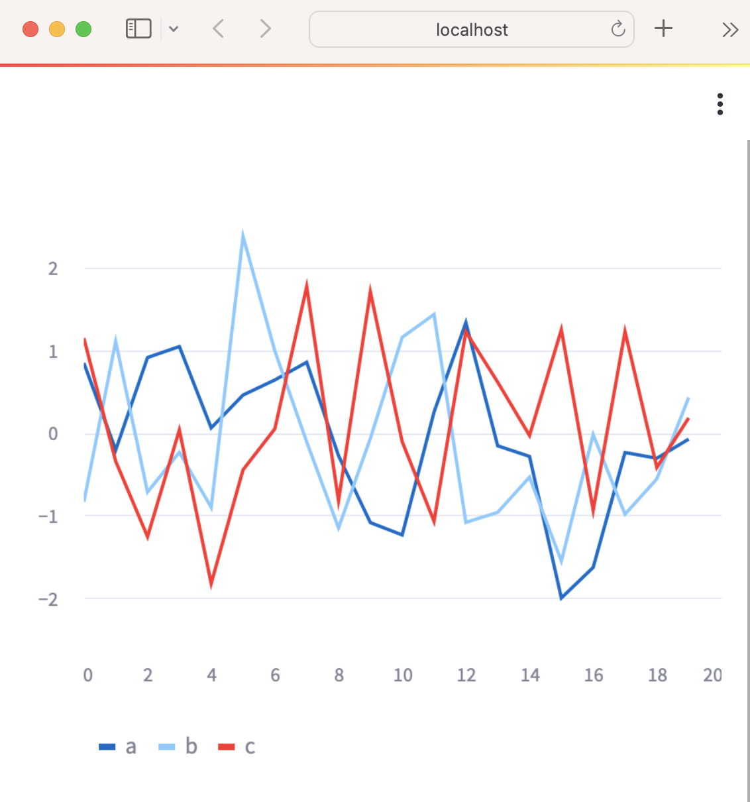
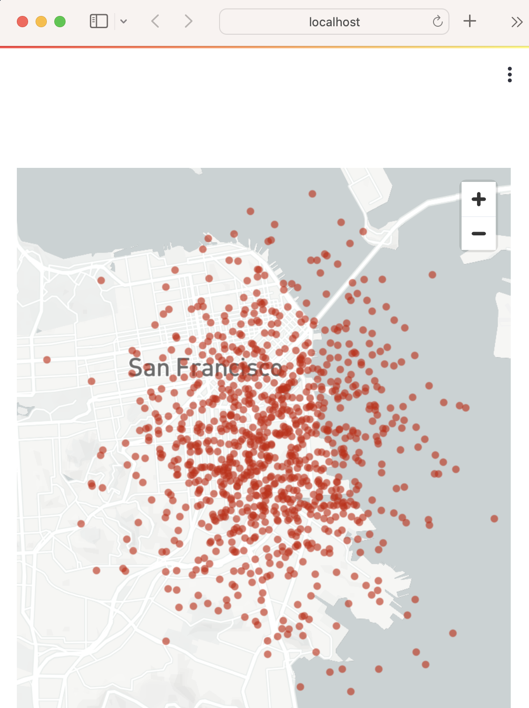
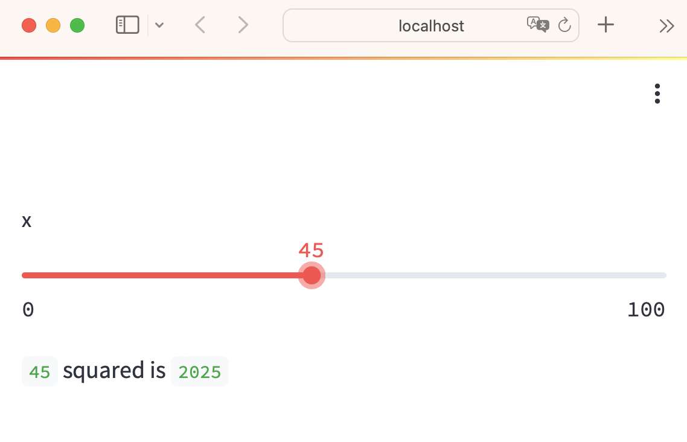
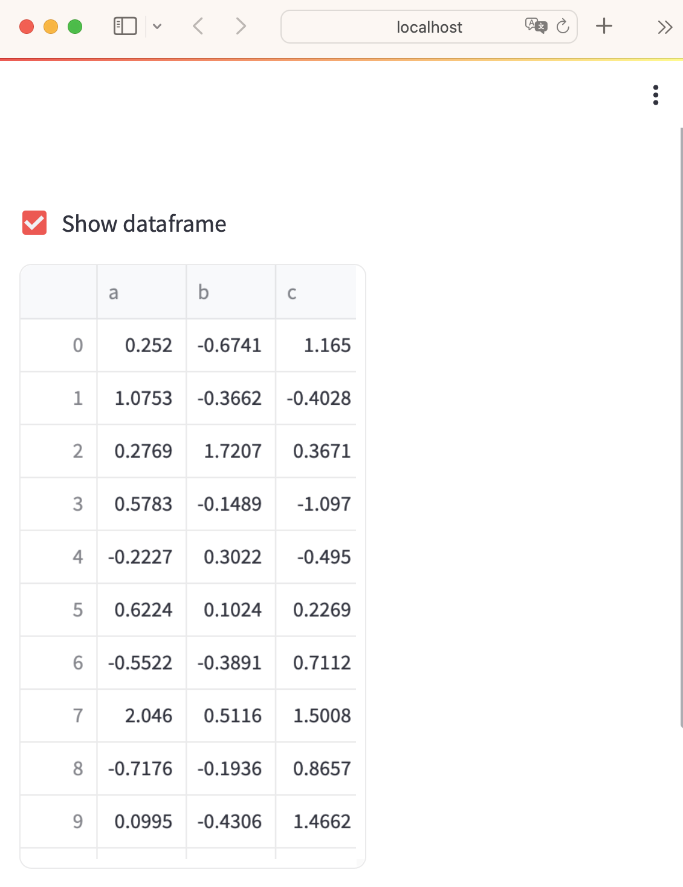
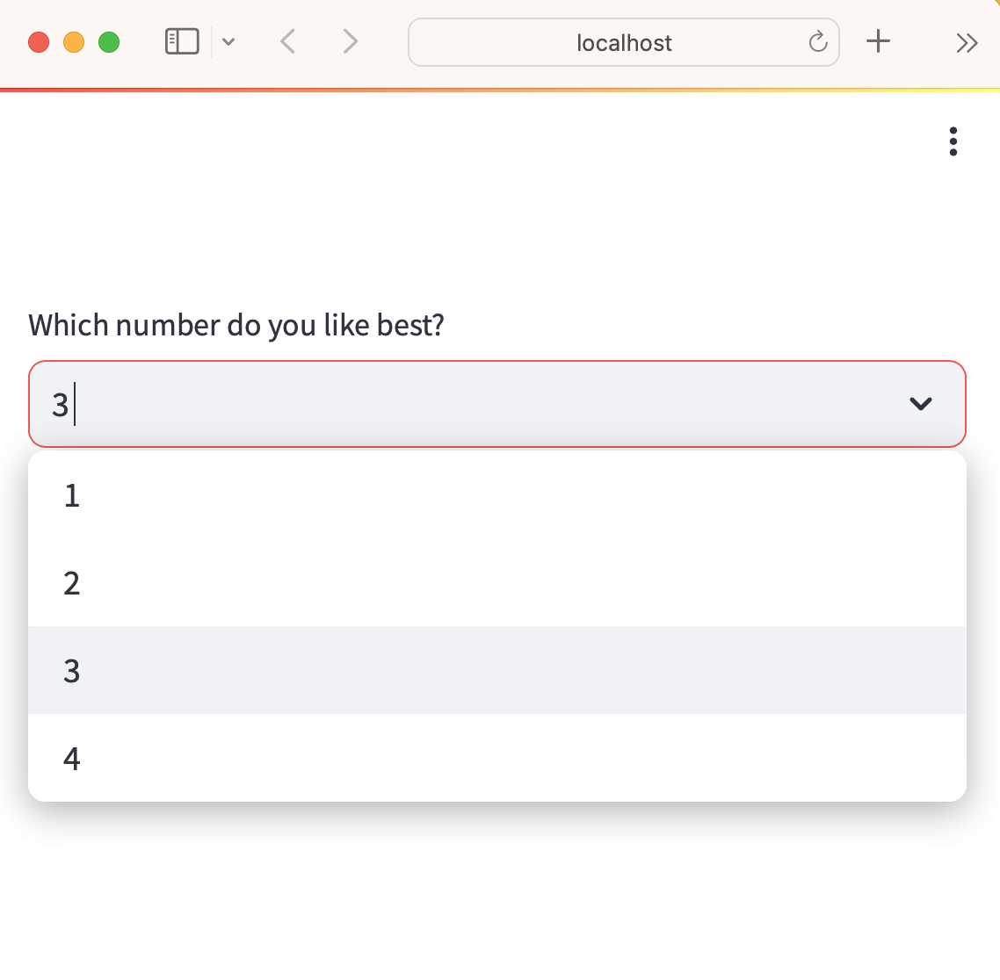
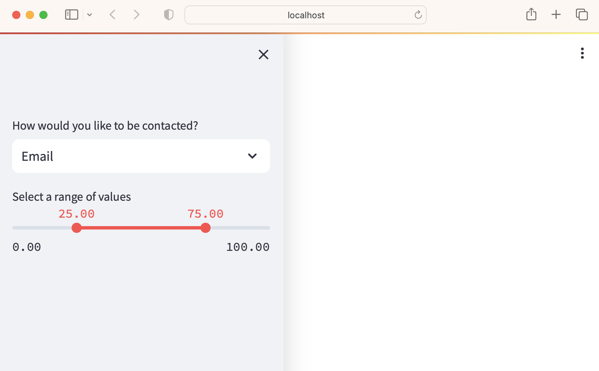
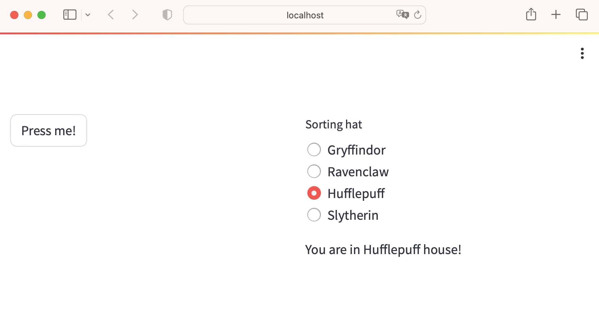
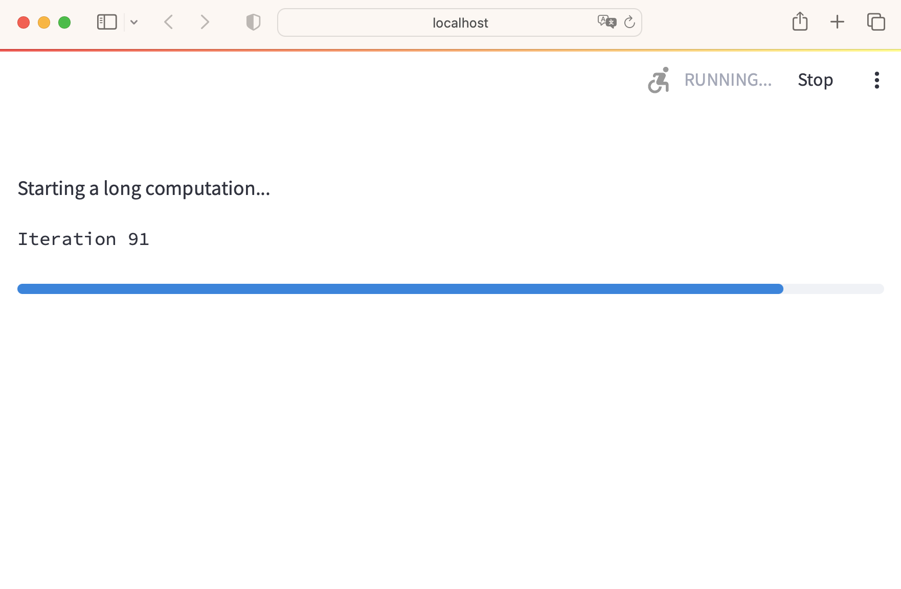

## 快速入門(重要觀念)

### 開發階段
- #### 開啟右上方'Always rerun',達到及時更新
- #### side by side(螢幕左右各開一個視窗,一個為編輯器,一個為browser)

### 程式執行流程
- streamlit的程式流程和一般視窗和後端程式不一樣
- streamlit在以下2程情況會自動更新螢幕畫面(streamlit會由上而下執行所有的程式碼)
	- app的程式碼被更新時
	- 當使用者和工具(widgets)互動時,如使用者按下按鈕

由於以上的特性,使用者和工具互動時,會觸發on_change 或(on_click)的事件，並執行事件的callback function，但後面的程式並還未執行

如果要執行大量的資料,要使用@st.cache_data decorator, 以便app有更好的執行效能。

### 畫面的顯示和資料的修飾
#### 神奇的st.write()
- 文字
- 圖片
- 表格
- DataFrame
- list

#### 範例1:顯示DataFrame

```python
# 當輸出df變數時,st.write()會自動執行
"""
# My first app
Here's our first attempt at using data to create a table:
"""

import streamlit as st
import pandas as pd
df = pd.DataFrame({
  'first column': [1, 2, 3, 4],
  'second column': [10, 20, 30, 40]
})

df
```


```python
# 也可以使用st.write(df)
import streamlit as st
import pandas as pd

st.write("Here's our first attempt at using data to create a table:")
st.write(pd.DataFrame({
    'first column': [1, 2, 3, 4],
    'second column': [10, 20, 30, 40]
}))
```

#### 範例2:
- 使用st.dataframe(),顯示Styler

```python
import streamlit as st
import numpy as np
import pandas as pd

dataframe = pd.DataFrame(
    np.random.randn(10, 20),
    columns=('col %d' % i for i in range(20)))

st.dataframe(dataframe.style.highlight_max(axis=0))
```


### 圖表和地圖

#### 範例3:線圖
- st.line_chart()

```python
import streamlit as st
import numpy as np
import pandas as pd

chart_data = pd.DataFrame(
     np.random.randn(20, 3),
     columns=['a', 'b', 'c'])

st.line_chart(chart_data)
```



#### 範例4:地圖

```python
import streamlit as st
import numpy as np
import pandas as pd

map_data = pd.DataFrame(
    np.random.randn(1000, 2) / [50, 50] + [37.76, -122.4],
    columns=['lat', 'lon'])

st.map(map_data)
```



### Widgets(互動工具)
- st.slider()
- st.button()
- st.selectbox()

#### 範例5 slider

```python
import streamlit as st
x = st.slider('x')  # 👈 this is a widget
st.write(x, 'squared is', x * x)
```



#### widgets工具內的key
- ##### 非常重要的觀念
- key會被儲存在st.session_state內
- 當程式重新由上往下讀(觸發事件),所有資料將被清除,除了st.session_state

#### 範例6 widget的key屬性

```python
import streamlit as st
st.text_input("Your name", key="name")

# You can access the value at any point with:
st.session_state.name
```


#### checkbox() 顯示/隱藏 資料
#### 範例7

```python
import streamlit as st
import numpy as np
import pandas as pd

if st.checkbox('Show dataframe'):
    chart_data = pd.DataFrame(
       np.random.randn(20, 3),
       columns=['a', 'b', 'c'])

    chart_data
```



#### selectbox 選擇資料
#### 範例8

```python
import streamlit as st
import pandas as pd

df = pd.DataFrame({
    'first column': [1, 2, 3, 4],
    'second column': [10, 20, 30, 40]
    })

option = st.selectbox(
    'Which number do you like best?',
     df['first column'])

'You selected: ', option
```



### 版面
- sliderbar
- columns
- expander

#### sliderbar
#### 範例9

```python
import streamlit as st

# Add a selectbox to the sidebar:
add_selectbox = st.sidebar.selectbox(
    'How would you like to be contacted?',
    ('Email', 'Home phone', 'Mobile phone')
)

# Add a slider to the sidebar:
add_slider = st.sidebar.slider(
    'Select a range of values',
    0.0, 100.0, (25.0, 75.0)
)
```



#### columns

#### 範例10

```
import streamlit as st

left_column, right_column = st.columns(2)
# You can use a column just like st.sidebar:
left_column.button('Press me!')

# Or even better, call Streamlit functions inside a "with" block:
with right_column:
    chosen = st.radio(
        'Sorting hat',
        ("Gryffindor", "Ravenclaw", "Hufflepuff", "Slytherin"))
    st.write(f"You are in {chosen} house!")
```



#### progress(進度)

#### 範例11

```
import streamlit as st
import time

'Starting a long computation...'

# Add a placeholder
latest_iteration = st.empty()
bar = st.progress(0)

for i in range(100):
  # Update the progress bar with each iteration.
  latest_iteration.text(f'Iteration {i+1}')
  bar.progress(i + 1)
  time.sleep(0.1)

'...and now we\'re done!'
```



## Caching
## Pages
## App model
