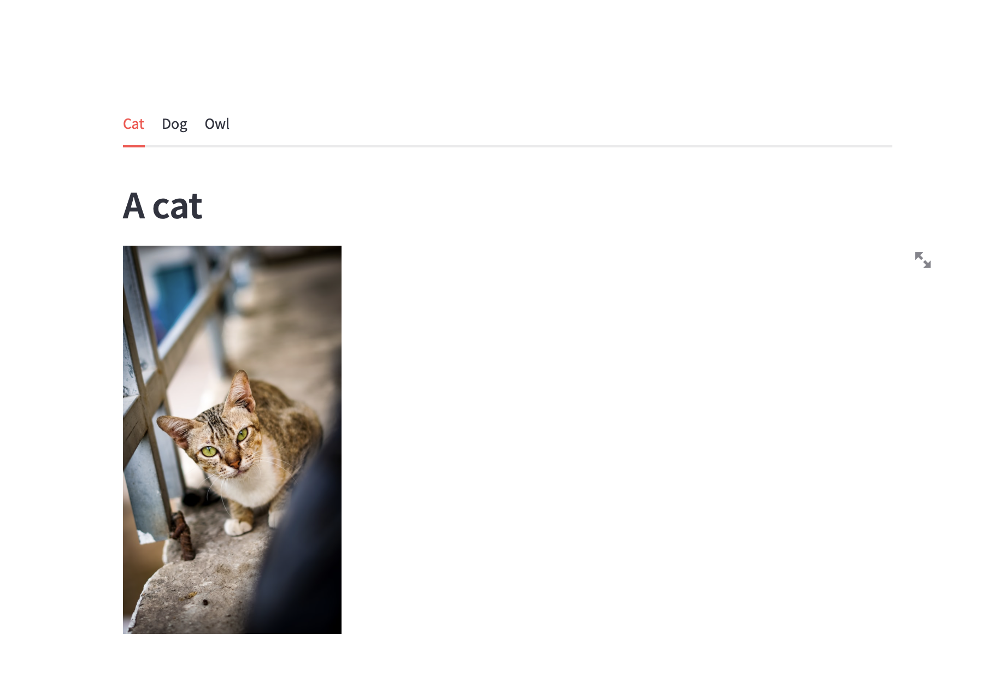
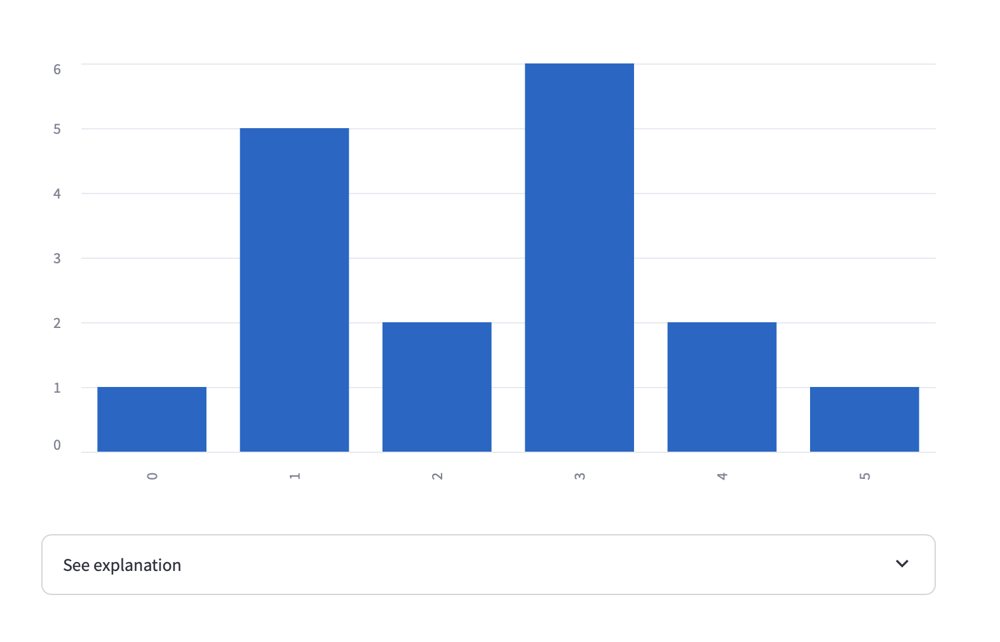
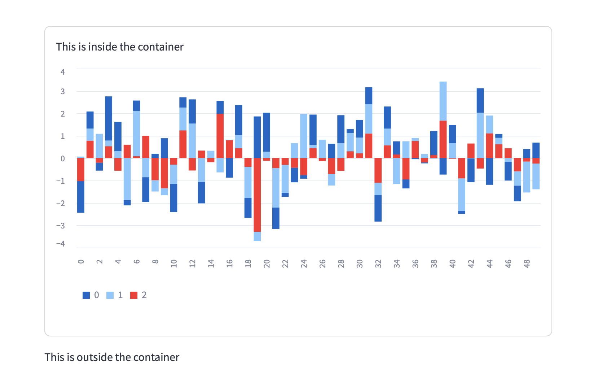

## 版面
### 版面
- sliderbar
- columns
- expander

## sliderbar
#### lesson9.py

```python
import streamlit as st

st.sidebar.markdown("## sidebar ")

# Add a selectbox to the sidebar:
add_selectbox = st.sidebar.selectbox(
    'How would you like to be contacted?',
    ('Email', 'Home phone', 'Mobile phone')
)

# Add a slider to the sidebar:
add_slider = st.sidebar.slider(
    'Select a range of values',
    0.0, 100.0, (25.0, 75.0)
)
```


---

## columns

#### lesson10.py

```
import streamlit as st

left_column, right_column = st.columns([1,1],gap="small")
# You can use a column just like st.sidebar:
left_column.button('Press me!')

# Or even better, call Streamlit functions inside a "with" block:
with right_column:
    chosen = st.radio(
        'Sorting hat',
        ("Gryffindor", "Ravenclaw", "Hufflepuff", "Slytherin"))
    st.write(f"You are in {chosen} house!")

```


---

## tabs
#### lesson11.py

```
import streamlit as st

tab1, tab2, tab3 = st.tabs(["Cat", "Dog", "Owl"])

with tab1:
   st.header("A cat")
   st.image("https://static.streamlit.io/examples/cat.jpg", width=200)

with tab2:
   st.header("A dog")
   st.image("https://static.streamlit.io/examples/dog.jpg", width=200)

with tab3:
   st.header("An owl")
   st.image("https://static.streamlit.io/examples/owl.jpg", width=200)
```



---

## expander
- expander不能放在其它的expander內

#### lesson12.py


```
import streamlit as st

st.bar_chart({"data": [1, 5, 2, 6, 2, 1]})

with st.expander("See explanation"):
    st.write("""
        The chart above shows some numbers I picked for you."
        I rolled actual dice for these, so they're *guaranteed* to
        be random.
    """)
    st.image("https://static.streamlit.io/examples/dice.jpg")
```



---

## container
#### lesson13.py

```
import streamlit as st
import numpy as np

with st.container(border=True):
   st.write("This is inside the container")

   # You can call any Streamlit command, including custom components:
   st.bar_chart(np.random.randn(50, 3))

st.write("This is outside the container")
```



---

## empty
- 只可以放一個元素的容器(只要使用container(),就可以變為可放多個元素)
- 可清除 - empty()
- 可加入 - insert()
- 可移除 - remove()

```

import streamlit as st

placeholder = st.empty()

# Replace the placeholder with some text:
placeholder.text("Hello")

# Replace the text with a chart:
placeholder.line_chart({"data": [1, 5, 2, 6]})

# Replace the chart with several elements:
# 將容器變為container()
with placeholder.container():
    st.write("This is one element")
    st.write("This is another")

# Clear all those elements:
#placeholder.empty()
```


