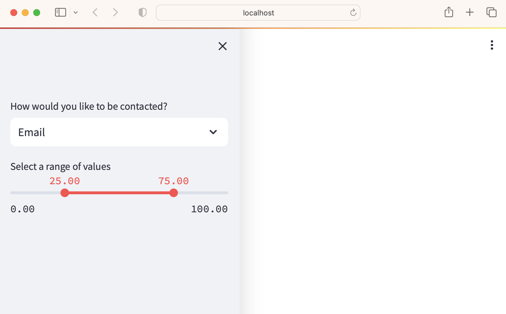
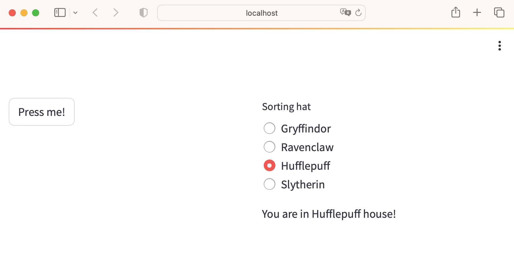

## 版面
### 版面
- sliderbar
- columns
- expander

#### sliderbar
#### 範例9

```python
import streamlit as st

st.sidebar.markdown("## sidebar ")

# Add a selectbox to the sidebar:
add_selectbox = st.sidebar.selectbox(
    'How would you like to be contacted?',
    ('Email', 'Home phone', 'Mobile phone')
)

# Add a slider to the sidebar:
add_slider = st.sidebar.slider(
    'Select a range of values',
    0.0, 100.0, (25.0, 75.0)
)
```



#### columns

#### 範例10

```
import streamlit as st

left_column, right_column = st.columns(2)
# You can use a column just like st.sidebar:
left_column.button('Press me!')

# Or even better, call Streamlit functions inside a "with" block:
with right_column:
    chosen = st.radio(
        'Sorting hat',
        ("Gryffindor", "Ravenclaw", "Hufflepuff", "Slytherin"))
    st.write(f"You are in {chosen} house!")
```




